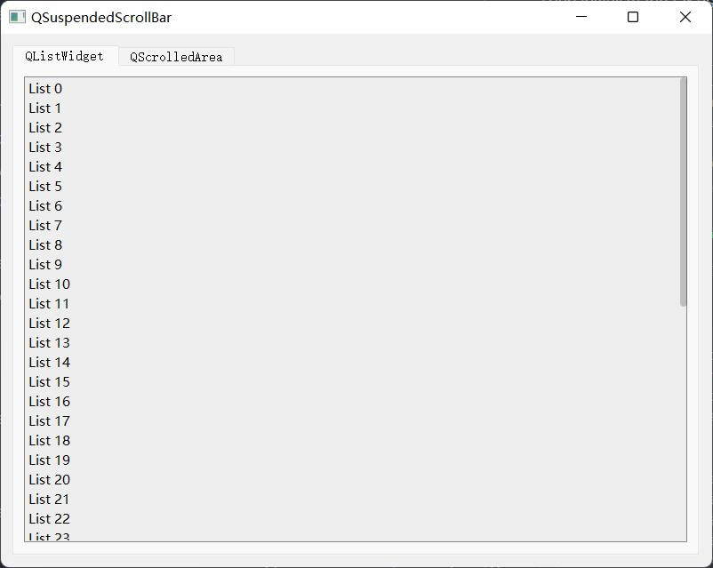
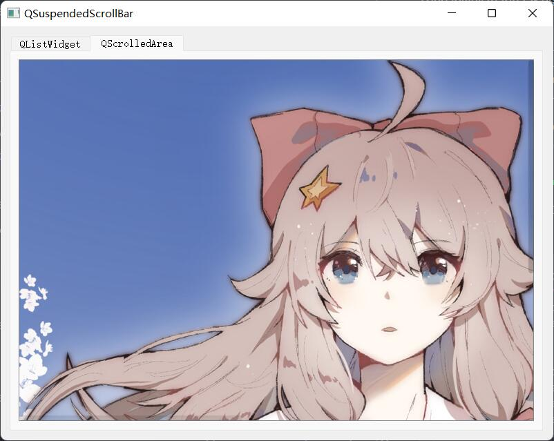

<h1 align="center">QSuspendedScrollBar</h1>

## Introduction

QSuspendedScrollBar is a suspended (translucent) scrollbar implementation, written in Qt5.

## Usage

Firstly, hide the default scrollbar of widget.

```cpp
this->setVerticalScrollBarPolicy(Qt::ScrollBarAlwaysOff);
this->setHorizontalScrollBarPolicy(Qt::ScrollBarAlwaysOff);
```

Then initialize the QSuspendedScrollBar object, and connect the signals and slots.

```cpp
m_verSuspendedScrollBar = new QSuspendedScrollBar(Qt::Vertical, this);
connect(this->verticalScrollBar(), SIGNAL(valueChanged(int)), m_verSuspendedScrollBar, SLOT(slotValueChanged(int)));
connect(m_verSuspendedScrollBar, SIGNAL(valueChanged(int)), this, SLOT(slotVerValueChanged(int)));
connect(this->verticalScrollBar(), SIGNAL(rangeChanged(int, int)), m_verSuspendedScrollBar, SLOT(slotRangeChanged(int, int)));

void QSuspendedScrollBar_ListWidget::slotValueChanged(int value) {
	this->verticalScrollBar()->setValue(value);
}
```

You also need to override these events: `resizeEvent`, `enterEvent`, `leaveEvent`.

```cpp
void QSuspendedScrollBar_ListWidget::resizeEvent(QResizeEvent *e) {
	int iX = this->width() - 8;
	m_suspendedScrollBar->setGeometry(iX, 1, 8, this->height() - 2);
	return QListWidget::resizeEvent(e);
}

void QSuspendedScrollBar_ListWidget::enterEvent(QEvent *e) {
	if (m_suspendedScrollBar->maximum() > 0)
		m_suspendedScrollBar->show();
	return QListWidget::enterEvent(e);
}

void QSuspendedScrollBar_ListWidget::leaveEvent(QEvent *e) {
	m_suspendedScrollBar->hide();
	return QListWidget::leaveEvent(e);
}
```

## Example

You can find the implementations of QListWidget and QScrollArea, both with QSuspendedScrollBar in `Example`.

<p align="center">
    
    
</p>